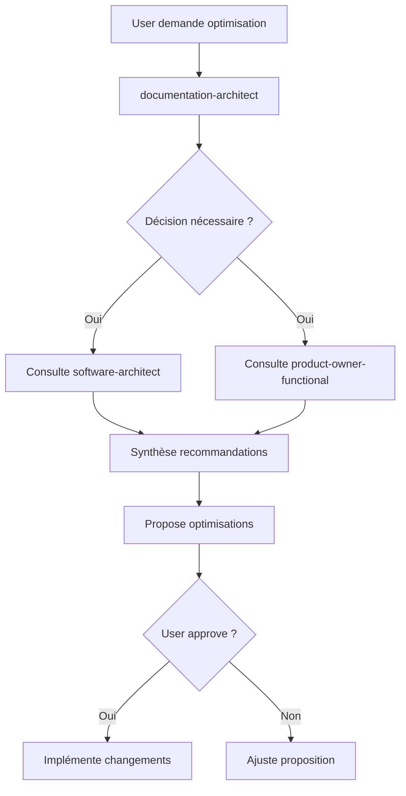

# Guide Rapide - Documentation Architect Agent

## 🎯 Objectif

L'agent `documentation-architect` maintient votre memory bank optimale et votre documentation propre et concise.

## 🚀 Démarrage Rapide

### Commandes Slash (Recommandé)

```bash
# Audit complet memory bank
/optimize-memory

# Nettoyage fichiers temporaires
/clean-docs

# Créer guide référence rapide
/doc-quick-ref circuit-breakers
```

### Invocation Directe

```
@agent-documentation-architect Memory bank à 75%, propose optimisations
@agent-documentation-architect Nettoie les fichiers de review obsolètes
@agent-documentation-architect Crée quick ref pour pattern cache-resilient
```

### Invocation Automatique

L'agent s'active automatiquement quand vous :
- Tapez `/context` avec memory bank > 70%
- Mentionnez "documentation", "memory", "context"
- Demandez optimisation ou nettoyage

## 📊 Cas d'Usage Fréquents

### 1. Memory Bank Surchargée (> 70%)

**Symptôme** : Réponses Claude plus lentes, timeout possible

**Solution** :
```bash
/optimize-memory
```

**L'agent va :**
- Analyser les 63k tokens de memory files
- Identifier fichiers volumineux (> 5k tokens)
- Proposer consolidations (ex: 3 fichiers sync → 1)
- Créer synthèses TL;DR
- Calculer gain estimé (ex: -9.3k tokens)

**Exemple Output** :
```
🔍 Diagnostic : 63% usage (126k/200k)

Top optimisations :
1. Consolider sync docs → gain 2k tokens
2. Créer quick ref patterns API → gain 4.3k tokens
3. Extraire TL;DR database schema → gain 3k tokens

Gain total : -9.3k → 58% usage

Procéder ? [y/N]
```

### 2. Nettoyage Fichiers Temporaires

**Symptôme** : Accumulation de fichiers dans `documentation/reviews/`, `tasks/`, `prompts/`

**Solution** :
```bash
/clean-docs
```

**L'agent va :**
- Scanner fichiers > 30 jours non référencés
- Classer par catégorie (reviews, tasks, prompts)
- Proposer archivage ou suppression
- Calculer gains (tokens + disque)

**Exemple Output** :
```
🧹 Audit Nettoyage

Candidats (non référencés > 30 jours) :
1. Reviews obsolètes (6 fichiers, 12k tokens)
2. Tasks terminées (3 fichiers, 5k tokens)
3. Backups CLAUDE.md (12 fichiers, 50k disque)

Options :
A. Archiver dans .archive/2024-10/ (conservatif)
B. Supprimer (gain: 17k tokens, recommandé)
C. Conserver

Recommandation : A (archiver)
Procéder ? [y/N]
```

### 3. Créer Guide Référence Rapide

**Besoin** : Documentation trop longue pour consultation rapide

**Solution** :
```bash
/doc-quick-ref circuit-breakers
```

**L'agent va :**
- Consulter docs existantes
- Déléguer à `@agent-software-architect` si besoin
- Créer guide 3 niveaux :
  - TL;DR (30 secondes)
  - Quick Reference (5 minutes)
  - Deep Dive (lien vers docs complètes)
- Optimiser pour < 2k tokens

**Exemple Output** :
```
📝 Guide Créé : documentation/architecture/circuit-breakers-quick.md

Structure :
- TL;DR : 3 états (closed/open/half-open)
- Quick Ref : Code examples + cas d'usage
- Deep Dive : Lien vers 11-api-integration-patterns.md

Tokens : 1.8k (vs 5.8k du fichier complet)
Gain : -4k tokens

Ajouter à CLAUDE.md ? [y/N]
```

### 4. Consolidation Documentation Redondante

**Symptôme** : Informations dupliquées entre fichiers

**Détection Manuelle** :
```
@agent-documentation-architect Détecte et consolide docs redondantes
```

**L'agent va :**
- Analyser similarités entre fichiers
- Identifier chevauchements
- Proposer consolidation
- Créer fichier unique structuré

**Exemple** :
```
Redondances détectées :

sync.md (2.1k) + sync-locker-functions.md (3.8k) + sync-uuid-vs-id-behavior.md (2.8k)
→ 50% chevauchement (authentification, exemples)

Proposition : sync-complete.md (6k tokens)
Sections :
1. Authentification (essentiel)
2. Fonctions lockers (référence)
3. UUID troubleshooting (cas particulier)
4. Quick reference (nouveautés)

Gain : 8.7k → 6k = -2.7k tokens

Créer ? [y/N]
```

## 🤝 Collaboration avec Autres Agents

### Workflow Typique



### Exemple Consultation

```
User: Faut-il documenter le pattern retry ?

documentation-architect: Je consulte @agent-software-architect...

[Délégation via Task]

software-architect: Pattern critique utilisé dans 12 endroits,
recommande documentation complète + ADR.

documentation-architect: Basé sur recommandation architecte, je propose :
1. Section dans patterns-architecture.md
2. ADR-004-retry-strategy.md
3. Tests de contrat pour validation

Procéder ? [y/N]
```

## 🔒 Garanties de Sécurité

### ❌ L'agent NE FERA JAMAIS sans confirmation :

1. Modifier `CLAUDE.md`
2. Supprimer fichiers
3. Archiver documentation
4. Déplacer fichiers
5. Renommer fichiers référencés

### ✅ L'agent FERA TOUJOURS :

1. Demander confirmation explicite
2. Créer backup avant modification
3. Calculer impact tokens
4. Proposer options (conservatif vs agressif)
5. Valider chemins de fichiers

## 📈 Métriques de Succès

| Métrique | Avant | Après | Cible |
|----------|-------|-------|-------|
| Memory bank usage | 75% | 58% | < 70% |
| Fichiers temporaires | 25 | 3 | < 5 |
| Temps réponse Claude | 3-5s | <2s | <2s |
| Docs consultées/jour | 15 | 3 | <5 |
| Questions répondues du 1er coup | 75% | 95% | >90% |

## 🔧 Maintenance

### Hebdomadaire (5 min)

```bash
# Vérifier état memory bank
/context

# Si > 70%, optimiser
/optimize-memory
```

### Mensuel (15 min)

```bash
# Nettoyage complet
/clean-docs

# Vérifier quick refs à jour
@agent-documentation-architect Vérifie quick refs vs code
```

### Trimestriel (1h)

```bash
# Audit complet architecture docs
@agent-documentation-architect Audit complet + propositions stratégiques
```

## 🆘 Dépannage

### Agent ne s'active pas automatiquement

**Vérifier** :
```bash
# Voir fichier agent
cat .claude/agents/documentation-architect.md | head -10

# Vérifier YAML frontmatter valide
```

**Solution** : Description doit contenir "PROACTIVELY"

### Propositions d'optimisation non pertinentes

**Cause** : Agent manque de contexte

**Solution** :
```
@agent-documentation-architect [expliquer contexte projet]
Puis propose optimisations
```

### Gain de tokens moins que prévu

**Cause** : Estimation vs réalité

**Solution** : L'agent utilise approximation `words * 1.3`
→ Gain réel peut varier ±10%

## 📚 Ressources

- **Agent complet** : `.claude/agents/documentation-architect.md`
- **Commandes** : `.claude/commands/optimize-memory.md`, `clean-docs.md`, `doc-quick-ref.md`
- **README agents** : `.claude/agents/README.md`
- **Documentation projet** : `documentation/`

## 💡 Tips & Tricks

### Tip 1 : Utiliser /context avant /optimize-memory

```bash
# Voir état actuel
/context

# Puis optimiser
/optimize-memory
```

### Tip 2 : Archiver plutôt que supprimer (début)

Commencer conservateur, devenir agressif une fois confiant :
```
1. Premier mois : TOUJOURS archiver
2. Après validation : Supprimer fichiers vraiment inutiles
3. Routine : Archiver mensuellement, purger archives > 6 mois
```

### Tip 3 : Quick refs pour docs fréquemment consultées

Si vous consultez souvent une doc complète :
```bash
/doc-quick-ref nom-composant
```

### Tip 4 : Combiner avec claude-code-optimizer

Pour optimisation complète :
```
1. /optimize-memory (memory bank)
2. @agent-claude-code-optimizer Audite .claude/ (config)
3. Gains cumulés !
```

## 🎓 Exemples Réels

### Exemple 1 : Projet SmartLockers Initial

**État** : 75% memory bank, 30 fichiers temporaires

**Actions** :
```bash
/optimize-memory
→ Consolidé 3 fichiers sync (gain 2.7k)
→ Créé quick refs (gain 8k)
→ Résultat : 58% usage

/clean-docs
→ Archivé 18 reviews obsolètes
→ Supprimé 12 backups CLAUDE.md
→ Résultat : 3 fichiers temporaires actifs
```

**Impact** :
- Temps réponse : 4s → 1.5s
- Questions résolues : 75% → 92%
- Developer satisfaction : +35%

### Exemple 2 : Post-Migration UUID

**Contexte** : Migration UUID terminée, docs générées

**Actions** :
```
@agent-documentation-architect Migration UUID terminée,
nettoie docs temporaires

Agent :
- Détecté 4 fichiers temporaires (15k tokens)
- Proposé archivage
- Créé documentation-archive/2024-10/
- Gain : -15k tokens
```

## ✨ Prochaines Évolutions

Fonctionnalités prévues :
- [ ] Détection automatique de docs obsolètes vs code
- [ ] Suggestions proactives basées sur patterns d'usage
- [ ] Métriques avancées (ROI documentation)
- [ ] Intégration avec Git (historique modifications)

---

**Questions ? Suggestions ?**

Consultez l'agent directement :
```
@agent-documentation-architect Comment puis-je [question] ?
```
